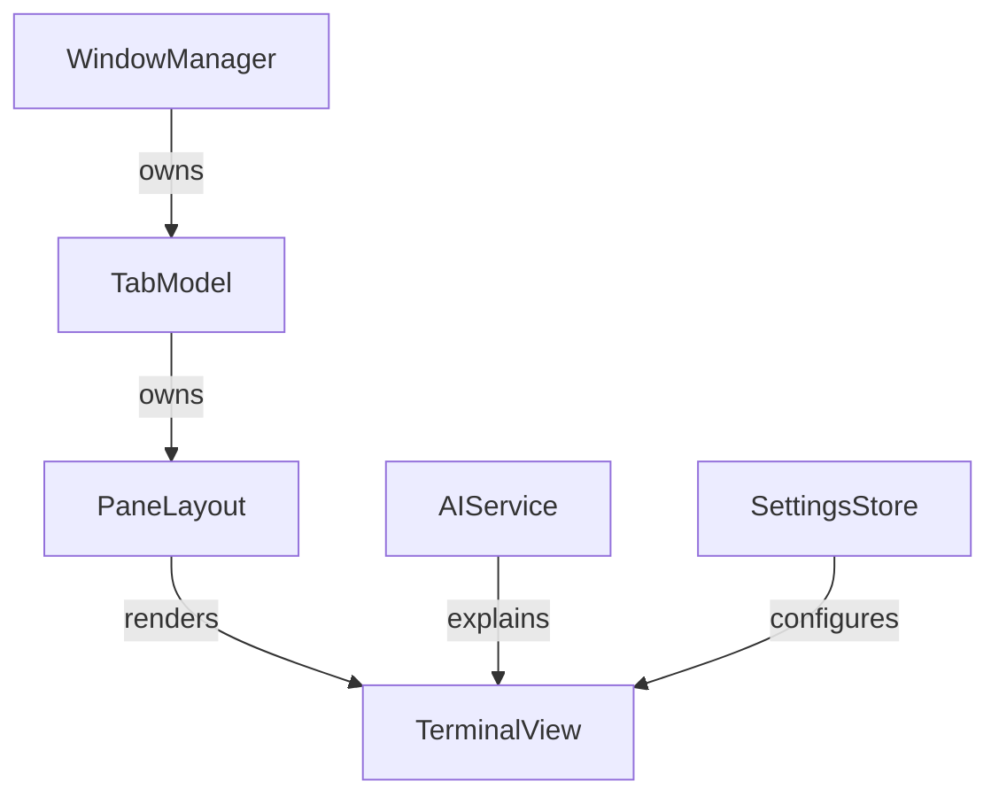

# LiquidTerm: Technical Documentation

## Table of Contents
1. [Overview](#overview)
2. [Product Requirements Document (PRD)](#product-requirements-document-prd)
3. [Technical Architecture](#technical-architecture)
   - [Module Breakdown](#module-breakdown)
   - [Data Flow](#data-flow)
   - [Security Model](#security-model)
4. [UI/UX Specification](#uiux-specification)
   - [Window Management](#window-management)
   - [Tab System](#tab-system)
   - [Pane Layout](#pane-layout)
   - [Accessibility](#accessibility)
   - [Keyboard Shortcuts](#keyboard-shortcuts)
5. [Core Features](#core-features)
   - [Multi-Window Support](#multi-window-support)
   - [Pane Grid System](#pane-grid-system)
   - [Terminal Engine](#terminal-engine)
   - [Liquid Glass UI](#liquid-glass-ui)
   - [AI Integration](#ai-integration)
   - [Command Palette](#command-palette)
6. [Implementation Details](#implementation-details)
   - [SwiftUI + AppKit Bridging](#swiftui--appkit-bridging)
   - [PaneLayout Binary Tree](#panelayout-binary-tree)
   - [PTY Integration](#pty-integration)
   - [AI Provider Abstraction](#ai-provider-abstraction)
7. [Testing Strategy](#testing-strategy)
   - [Unit Tests](#unit-tests)
   - [UI Tests](#ui-tests)
   - [Accessibility Audit](#accessibility-audit)
8. [Build & Deployment](#build--deployment)
9. [Future Roadmap](#future-roadmap)
10. [Appendices](#appendices)
    - [Glossary](#glossary)
    - [API References](#api-references)

---

## Overview
**LiquidTerm** is a native macOS terminal emulator designed for power users and accessibility. It combines:
- **Multi-window, multi-tab workflows** (like iTerm2).
- **Draggable pane grids** with zoom/focus.
- **Liquid Glass UI** (translucent materials, rounded corners, dynamic blur).
- **Built-in AI assistance** (command explanation, error diagnosis, snippet generation).
- **First-class accessibility** (per-pane font scaling, high contrast, VoiceOver).

**Tagline**: *A liquid-glass, fullscreen-first macOS terminal with multi-window panes, tabs, and built-in AI assistance.*

**Target**: macOS 14+ (Sonoma) for modern SwiftUI/AppKit bridging.

---

## Product Requirements Document (PRD)

### Goals
1. **Native macOS Experience**: Leverage SwiftUI + AppKit for performance and HIG compliance.
2. **Professional Workflows**: Multi-window, multi-tab, and pane grids with drag-and-drop.
3. **Accessibility-First**: Support vision-impaired users with dynamic font scaling, high contrast, and VoiceOver.
4. **AI-Powered Assistance**: Secure, pluggable AI for command explanation, error diagnosis, and snippet generation.
5. **Liquid Glass Aesthetic**: Translucent materials, rounded corners, and dynamic blur (respecting Reduce Transparency).

### Non-Goals
- iOS/iPadOS support.
- Plugin system (Phase 3).
- Full terminal emulator (Phase 2: stub first, then PTY).

### User Stories
| Role               | Story                                                                                     |
|--------------------|------------------------------------------------------------------------------------------|
| Developer          | Drag a tab to a new window to work across multiple displays.                             |
| Sysadmin           | Split panes vertically/horizontally and resize with drag handles.                        |
| Vision-Impaired User | Adjust per-pane font size and enable high-contrast mode.                                |
| Beginner           | Select a command and ask "Explain this" to get a plain-English breakdown.              |
| Designer           | Customize blur intensity, corner radius, and background opacity.                         |

### Acceptance Criteria
- [x] App launches with a single window/tab/pane (stub terminal).
- [x] Drag tab to new window; drag pane to new tab/window.
- [x] Split panes, resize with handles, zoom pane.
- [x] AI panel explains selected text (stub responses).
- [x] Font slider adjusts all panes; per-pane override works.
- [x] "Reduce Transparency" toggles blur; text remains legible.

---

## Technical Architecture

### Module Breakdown
| Module            | Responsibility                                                                           |
|-------------------|------------------------------------------------------------------------------------------|
| **WindowManager** | Multi-window lifecycle (`NSWindow` + `NSWindowController`).                              |
| **TabModel**      | Tabs and active pane state (`ObservableObject`).                                         |
| **PaneLayout**    | Binary split tree for pane arrangement (recursive enum).                                |
| **TerminalView**  | Stub for Phase 1; later `NSViewRepresentable` for PTY.                                   |
| **AIService**     | Protocol-based AI providers (OpenAI, Anthropic, Local).                                 |
| **SettingsStore** | Persistence for appearance/AI settings (`UserDefaults` + `Keychain`).                   |

### Data Flow


### Security Model
- **API Keys**: Stored in macOS Keychain (`kSecClassGenericPassword`).
- **Redaction**: Regex to mask secrets (e.g., `AWS_SECRET_ACCESS_KEY=...`).
- **Logging**: Structured local logs; never log raw keys or sensitive output.

---

## UI/UX Specification

### Window Management
- **Toolbar**: New tab, AI panel, settings, command palette.
- **Tab Strip**: Drag to reorder; double-click to rename.
- **Window Chrome**: Subtle glass effect (respects Reduce Transparency).

### Tab System
- **Drag-and-Drop**: Tabs can be dragged to new windows or reordered.
- **Context Menu**: Close tab, split pane, rename tab.

### Pane Layout
- **Binary Split Tree**: Leaf = terminal session; node = split direction + ratio.
- **Drag Handles**: Resize split ratio.
- **Commands**:
  - Split right/left/up/down (`⌘D`, `⌘⇧D`).
  - Close pane (`⌘W`).
  - Focus next/previous pane (`⌘⌥→`).
  - Zoom pane (`⌘⇧Z`).

### Accessibility
| Feature                     | Implementation                                                                           |
|-----------------------------|------------------------------------------------------------------------------------------|
| Font Scaling                | Global slider (12–28pt) + per-pane override.                                             |
| High Contrast               | Toggle in settings; ensures WCAG 2.1 AA compliance.                                      |
| Reduce Transparency         | Disables blur; replaces with solid background.                                           |
| VoiceOver                   | Labels for panes/tabs (e.g., "Pane 1, Shell, Active").                                  |
| Keyboard Navigation         | Full control via shortcuts (see [Keyboard Shortcuts](#keyboard-shortcuts)).             |

### Keyboard Shortcuts
| Action               | Shortcut          |
|----------------------|-------------------|
| New Window           | ⌘N                |
| New Tab              | ⌘T                |
| Close Tab            | ⌘W                |
| Split Right          | ⌘D                |
| Split Down           | ⌘⇧D               |
| Focus Next Pane      | ⌘⌥→               |
| Zoom Pane            | ⌘⇧Z               |
| Command Palette      | ⌘⇧P               |
| Font +1              | ⌘+                |
| Font -1              | ⌘-                |

---

## Core Features

### Multi-Window Support
- **Implementation**: `NSWindow` + `NSWindowController`.
- **Persistence**: Restore last session layout (JSON + `Codable`).

### Pane Grid System
- **Data Structure**: Binary split tree (recursive enum).
  ```swift
  indirect enum PaneLayout: Codable {
      case leaf(id: UUID, session: TerminalSession)
      case split(orientation: SplitOrientation, ratio: Double, left: PaneLayout, right: PaneLayout)
  }
  ```
- **Operations**: Split, close, zoom, swap.

### Terminal Engine
- **Phase 1**: Stub `NSTextView` with fake prompt.
- **Phase 2**: Real PTY integration (`forkpty` + ANSI parsing).
  - Use `NSViewRepresentable` to bridge `NSScrollView` + `NSTextView`.
  - Parse ANSI escape sequences (recommend `SwiftANSI` library).

### Liquid Glass UI
- **Materials**: `NSVisualEffectView` with `.sidebar` material.
- **Customization**:
  - Blur intensity.
  - Corner radius.
  - Background opacity.
- **Accessibility**: Respects Reduce Transparency and Increase Contrast.

### AI Integration
- **Providers**: OpenAI, Anthropic, Local (placeholder).
- **Features**:
  - Explain selected command/output.
  - Generate shell snippet (with safety: preview before running).
  - Chat sidebar (scoped per tab or global).
- **Security**:
  - API keys stored in Keychain.
  - Redaction layer masks secrets.

### Command Palette
- **Shortcut**: `⌘⇧P`.
- **Actions**: Split, close pane, open settings, change theme, AI actions.
- **Search**: Fuzzy search for commands.

---

## Implementation Details

### SwiftUI + AppKit Bridging
- **`NSViewRepresentable`**: Wrap `NSScrollView` + `NSTextView` for terminal rendering.
- **`NSVisualEffectView`**: Use `VisualEffectView` wrapper for glass effects.

### PaneLayout Binary Tree
- **Operations**:
  ```swift
  func split(_ orientation: SplitOrientation) {
      guard case let .leaf(id, session) = paneLayout else { return }
      let newSession = TerminalSession(id: UUID(), title: "Shell", fontSize: session.fontSize)
      paneLayout = .split(
          orientation: orientation,
          ratio: 0.5,
          left: .leaf(id: id, session: session),
          right: .leaf(id: newSession.id, session: newSession)
      )
  }
  ```

### PTY Integration
- **Phase 2**: Use `forkpty` to spawn a shell process.
- **Rendering**: Metal-backed text rendering (later optimization).

### AI Provider Abstraction
- **Protocol**:
  ```swift
  protocol AIProvider {
      func explain(text: String, completion: @escaping (Result<String, Error>) -> Void)
      func generateCommand(prompt: String, completion: @escaping (Result<String, Error>) -> Void)
  }
  ```
- **Providers**: OpenAI, Anthropic, Local (placeholder).

---

## Testing Strategy

### Unit Tests
- **PaneLayout**: Test split/close/zoom operations.
- **AIService**: Test provider fallback and redaction.

### UI Tests
- **Multi-Window**: Drag tab to new window; verify `WindowManager` updates.
- **Accessibility**: Toggle "Reduce Transparency"; verify text contrast.

### Accessibility Audit
- **VoiceOver**: Navigate panes/tabs; verify labels.
- **Keyboard-Only**: Tab through UI; verify focus order.

---

## Build & Deployment
1. **Prerequisites**:
   - Xcode 15+.
   - macOS 14+.
2. **Build**:
   ```bash
   xcodebuild -project LiquidTerm.xcodeproj -scheme LiquidTerm -destination 'platform=macOS' build
   ```
3. **Run**:
   ```bash
   open -a LiquidTerm.app
   ```

---

## Future Roadmap
1. **Phase 2**: Real PTY integration (`forkpty` + ANSI parsing).
2. **Phase 3**: Plugin system (custom themes, shell integrations).
3. **Phase 4**: iCloud sync for settings/sessions.

---

## Appendices

### Glossary
| Term               | Definition                                                                               |
|--------------------|------------------------------------------------------------------------------------------|
| PTY                | Pseudoterminal (Unix API for terminal emulation).                                        |
| Liquid Glass       | Visual style: translucent materials, rounded corners, dynamic blur.                     |
| Split Tree         | Binary tree for pane layout (leaf = session, node = split direction + ratio).            |

### API References
- [SwiftUI](https://developer.apple.com/documentation/swiftui)
- [AppKit](https://developer.apple.com/documentation/appkit)
- [NSVisualEffectView](https://developer.apple.com/documentation/appkit/nsvisualeffectview)
- [forkpty](https://man7.org/linux/man-pages/man3/forkpty.3.html)
