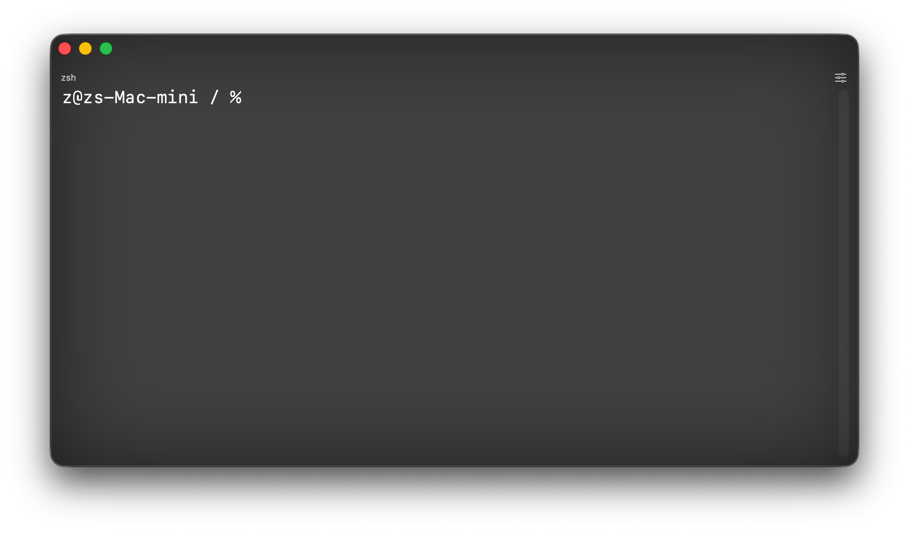

# LiquidTerm 🌊

**LiquidTerm** is an elegant, modern, high-performance terminal emulator for macOS, built entirely with Swift and SwiftUI. It brings a visually stunning "liquid glass" aesthetic to your command-line workflow while retaining native platform feel and rock-solid PTY support based on POSIX APIs.



## Features 🚀

- **Full Terminal Emulation:** VT100/xterm-compatible grid-based emulator. Run `htop`, `vim`, `nano`, `less`, `man`, and any TUI program with correct rendering.
- **256-Color & Truecolor:** Full SGR support — standard 16, 256-palette, and 24-bit RGB colors with bold, dim, underline, inverse, and strikethrough.
- **Alternate Screen Buffer:** Programs like `htop` and `vim` switch to a clean alternate screen and restore on exit — just like a real terminal.
- **Liquid Glass Translucency:** Immersive workspace with dynamic under-window blurring and true transparency, blending seamlessly with your macOS wallpaper.
- **Robust POSIX PTY Engine:** A lean pseudo-terminal handler written from scratch with `forkpty` ensuring snappy input and low-latency rendering.
- **Lightweight & Native:** Built with `NSTextView` + `NSAttributedString` for near zero-overhead memory impact. No bulky web technologies (Electron/Chromium) in sight.

## Tech Stack 🛠

- **Swift 5 & SwiftUI**
- **macOS AppKit** (NSTextView, NSAttributedString, NSVisualEffectView)
- **Darwin POSIX APIs** (`forkpty`, `ioctl`, `termios`)
- **Custom VT100 Parser** (ANSI CSI, SGR, OSC, DEC private modes)

## How to Build 📦

LiquidTerm requires Xcode or the macOS Command Line Tools to build. Ensure you are running macOS 14.0+.

```bash
git clone https://github.com/seanito14/LiquidTerm.git
cd LiquidTerm
xcodebuild -project LiquidTerm.xcodeproj -scheme LiquidTerm -configuration Release build
```

Then you can find and launch `LiquidTerm.app` from the `build` directory or derived data.

## Credits 🧠

Built and refined collaboratively with the help of powerful AI coding assistants:

- **Mistral** (via OpenClaw/Mistral-based workflows) - Aided in initial architectural concepts and logic design.
- **Antigravity** (Google Deepmind) - Deep-dived into Darwin PTY integrations, squashed persistent ANSI/Zsh formatting artifacts, mapped control characters, and engineered the liquid glass translucency effects.

---
*Created for tech enthusiasts working in the modern macOS ecosystem.*
